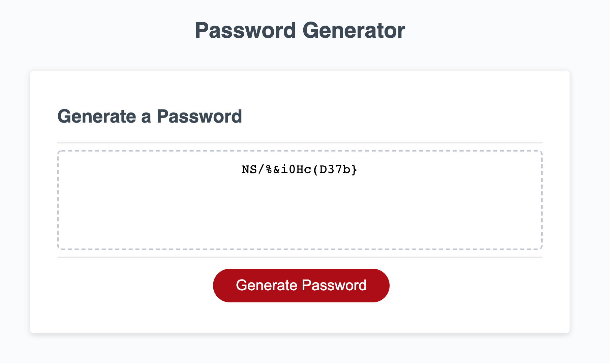

# Password Generator

#### This is a site made by HTML, CSS and JavaScript

#### Ellyse Carter

## Description
This website is a password generator to create unique passwords. 

After a client clicks the "Generate Password" button, they first choose between 8 and 128 characters, they can then select to use uppercase, lowercase, numeric, or special characters. After that, the system creates their unique password and displays it on the screen for them.

## Setup/Installation Requirements
Open terminal or a similar app on your computer
change directory to Desktop
copy https://github.com/ellysecarter/passwordgen.git
use git clone and paste that link after it to clone the repository
open the folder it provides
open the HTML folder inside
You can also click the following link
https://ellysecarter.github.io/passwordgen/. 
Github repo can be found at https://github.com/ellysecarter/passwordgen

## Technique
I originally wanted every piece of criteria to have their own if/else statement. After further thought, I combined all the criteria only after they chose the amount of characters they wanted and made one else statement at the end of the generatePassword function. It looks a lot more cleaner this way and makes a lot more sense.

## Known Bugs
none 

## Contact Details
email: ellysecarter@yahoo.com

## Technologies Used
HTML CSS Javascript

md
